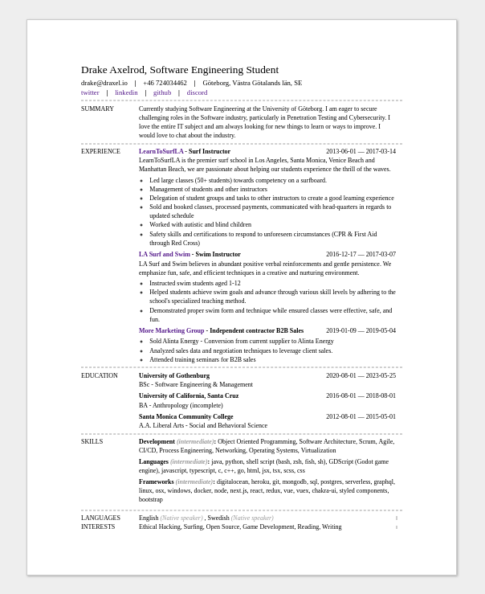

# [JSON Resume as a Service](https://resume-service.vercel.app)

[](https://vercel.com/new/clone?repository-url=https%3A%2F%2Fgithub.com%2FDrakeAxelrod%2Fjson-resume-service)

<p align="center">

</p>

Serverless service that uses the [jsonresume.org](https://jsonresume.org/) schema to generate dynamic resumes from a github gist that you can download or recieve back as a http response.

We use puppeteer with a headless chromium to essentially render an HTML page and convert to a pdf.

## What is a json resume?

Have you spent countless hours making a resume only to end up having to redo it with you want to change the format? what json resume does is allow for you to input your data in one place and then dynamically generate your resume with different templates you can learn more about this at their website [what is a json resume](https://jsonresume.org/getting-started/)

The following is a basic schema:[^1]

```json
{
  "basics": {
    "name": "John Doe",
    "label": "Programmer",
    "image": "",
    "email": "john@gmail.com",
    "phone": "(912) 555-4321",
    "url": "https://johndoe.com",
    "summary": "A summary of John Doe…",
    "location": {
      "address": "2712 Broadway St",
      "postalCode": "CA 94115",
      "city": "San Francisco",
      "countryCode": "US",
      "region": "California"
    },
    "profiles": [
      {
        "network": "Twitter",
        "username": "john",
        "url": "https://twitter.com/john"
      }
    ]
  },
  "work": [
    {
      "name": "Company",
      "position": "President",
      "url": "https://company.com",
      "startDate": "2013-01-01",
      "endDate": "2014-01-01",
      "summary": "Description…",
      "highlights": ["Started the company"]
    }
  ],
  "volunteer": [
    {
      "organization": "Organization",
      "position": "Volunteer",
      "url": "https://organization.com/",
      "startDate": "2012-01-01",
      "endDate": "2013-01-01",
      "summary": "Description…",
      "highlights": ["Awarded 'Volunteer of the Month'"]
    }
  ],
  "education": [
    {
      "institution": "University",
      "url": "https://institution.com/",
      "area": "Software Development",
      "studyType": "Bachelor",
      "startDate": "2011-01-01",
      "endDate": "2013-01-01",
      "score": "4.0",
      "courses": ["DB1101 - Basic SQL"]
    }
  ],
  "awards": [
    {
      "title": "Award",
      "date": "2014-11-01",
      "awarder": "Company",
      "summary": "There is no spoon."
    }
  ],
  "publications": [
    {
      "name": "Publication",
      "publisher": "Company",
      "releaseDate": "2014-10-01",
      "url": "https://publication.com",
      "summary": "Description…"
    }
  ],
  "skills": [
    {
      "name": "Web Development",
      "level": "Master",
      "keywords": ["HTML", "CSS", "JavaScript"]
    }
  ],
  "languages": [
    {
      "language": "English",
      "fluency": "Native speaker"
    }
  ],
  "interests": [
    {
      "name": "Wildlife",
      "keywords": ["Ferrets", "Unicorns"]
    }
  ],
  "references": [
    {
      "name": "Jane Doe",
      "reference": "Reference…"
    }
  ],
  "projects": [
    {
      "name": "Project",
      "description": "Description…",
      "highlights": ["Won award at AIHacks 2016"],
      "keywords": ["HTML"],
      "startDate": "2019-01-01",
      "endDate": "2021-01-01",
      "url": "https://project.com/",
      "roles": ["Team Lead"],
      "entity": "Entity",
      "type": "application"
    }
  ]
}
```

## Why use this service?

Because it allows you to provide resumes in various styles as a service. This means that you define one data file (a resume.json) and you upload it as a public gist to github. Then you can provide that information to this service which whill dynamically generate resumes according to compliant formatters. This means that you can create professional looking resumes within seconds after defining your json resume.

## Deploy your own

You'll want to fork this repository and deploy your own resume generator service.

1. Click the fork button at the top right of GitHub or just click this link [Fork](https://github.com/DrakeAxelrod/json-resume-service/fork)
2. Clone your forked repository

```bash
git clone URL_OF_FORKED_REPO_HERE
```

3. Change directory to your local copy of the forked repository

```bash
cd resume-service
```

6. Run locally with the project locally

```bash
yarn dev or npm run dev
```

7. Visit [localhost:3000](http://localhost:3000)
   - if nothing happens, run

```bash
npm i
# or if you use yarn
yarn
```

7. Deploy to the cloud by running going to [Vercel](https://vercel.com/) and making an account if you don't have one or you another hosting service of your choice.

## Authors

- Drake Axelrod ([@drakeaxelrod](https://twitter.com/drakeaxelrod)) - [website](https://www.draxel.io)

## Contributors

<!-- ALL-CONTRIBUTORS-LIST:START - Do not remove or modify this section -->
<!-- prettier-ignore-start -->
<!-- markdownlint-disable -->
<table>
  <tr>
    <td align="center">
      <a href="https://github.com/DrakeAxelrod">
        
      </a>
      <br />
      <sub>
        <b>Drake Axelrod</b>
      </sub>
    </td>
  </tr>
</table>

## License

MIT © [Drake Axelrod](https://github.com/DrakeAxelrod)

👉 [license](https://github.com/DrakeAxelrod/json-resume-service/blob/main/LICENSE.md)

## Footer

[^1]: [json resume basic schema](https://jsonresume.org/schema/)
