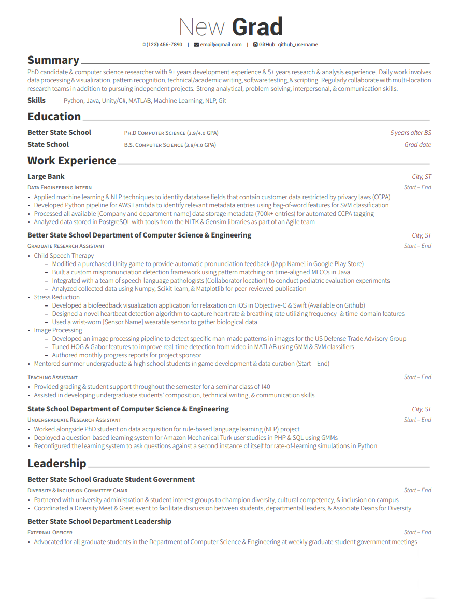

# ATS Friendly Resume

## What is it? [^1]

An ATS-compliant resume is a document created in a way that lets the applicant tracking system parse the application with ease. The formatting is simple and easy to scan. ATS-friendly resumes also contain keywords that match the job ad, highlight relevant work experience and professional skills.

## Statistics [^1]

It’s estimated that over 75% of the recruiters use some ATS. Other sources say that up to 98% of Fortune 500 companies rely on Applicant Tracking Systems. About 94% of those who incorporated some sort of ATS into their recruitment process say it has improved the hiring process.

## Recommended Fonts [^2]

1. Calibri
    - **Pros:** As a default font, Calibri will usually render correctly when a hiring manager opens your resume. It’s a professional and easy-to-read font, and it won the TDC2 2005 Type System award from the Type Directors Club.
    - **Cons:** As a default font, it also means other job seekers may use Calibri, which means your resume might not stand out from others.
2. Cambria
    - **Pros:** Cambria makes it easy for readers to quickly decipher smaller text sizes.
    - **Cons:** It is often described as “traditional,” which may make it less suitable for more modern jobs.
3. Helvetica
    - **Pros:** A lot of professionals rank Helvetica as one of the more beautiful sans-serif fonts. A perfect font to use on a CV!
    - **Cons:** Helvetica comes preloaded on Macs, but you aren’t going to find it listed under fonts in Microsoft Word. You’re going to have to buy it if you want to use it and don’t have a Mac.
4. Georgia
    - **Pros:** You can find Georgia across writing platforms. It’s accessible and a fine replacement font for other serif typefaces, like Times New Roman. Recently (2013) re-released and updated, so it’s up to date.
    - **Cons:** Georgia’s popularity may make it hard for you to stand out. Also, it was inspired by Scotch Roman designs of the 19th century, so if you want to stand out, you might want to go with something else.
5. Verdana
    - **Pros:** Great for job seekers who need to squeeze more onto their resumes, as it was optimized for small-print legibility.
    - **Cons:** If you’re seeking a “wow” CV font, keep on looking. Verdana doesn’t look all that different from Arial and Arial looks like Helvetica.
6. Garamond
    - **Pros:** Among designers and ad managers, Garamond is a favorite. It meets all the requirements of a good resume font: easy to read, attractive, classy, and not something everyone and their mother uses.
    - **Cons:** Some might say that Garamond’s timelessness is just a more optimistic way of saying that it’s old; it is from the 1400s, remember?
7. Trebuchet MS
    - **Pros:** Microsoft released Trebuchet as one of their core fonts for the web. You can find it easily even on competitors such as Google Docs.
    - **Cons:** If you want to utilize some additional features for the Trebuchet MS font, such as small caps or text figures, you’ll have to pay for the commercial version, Trebuchet Pro.
8. Lato
    - **Pros:** As an open source font (SIL Open Font License), you can download and use it for free. Lato is also a corporate font, so you can rest assured that it’ll work well on your resume. It can be found in the Google Font library openly.
    - **Cons:** Lato is not a standard Microsoft Word font. That might mean that it will not load when some hiring managers open your resume.
9. Book Antiqua
    - **Pros:** As a Microsoft version of Palatino, it is readily available on most operating systems and office programs.
    - **Cons:** Palatino is based on humanist styles of the Italian Renaissance, so it may make your resume feel, well, antiqua.
10. Didot
    - **Pros:** Many professionals associate the font with fashion; Ralph Lauren and Marks & Spencer use Didot on their websites. Its elegance qualifies as a safe choice if you must go with something fancy.
    - **Cons:** You must purchase Didot if you want to use it on your resume. Too much Didot on a page takes it from tastefully elegant to endangering your resume from suffering the same fate as Madame Déficit.

### Good Examples

Pretty sure this is the same and using LaTeX is a really good idea

- https://github.com/posquit0/Awesome-CV

### References

[^1]: https://zety.com/blog/ats-resume#:~:text=An%20ATS%2Dcompliant%20resume%20is,work%20experience%20and%20professional%20skills. 
[^2]: https://zety.com/blog/best-fonts-for-resume 
